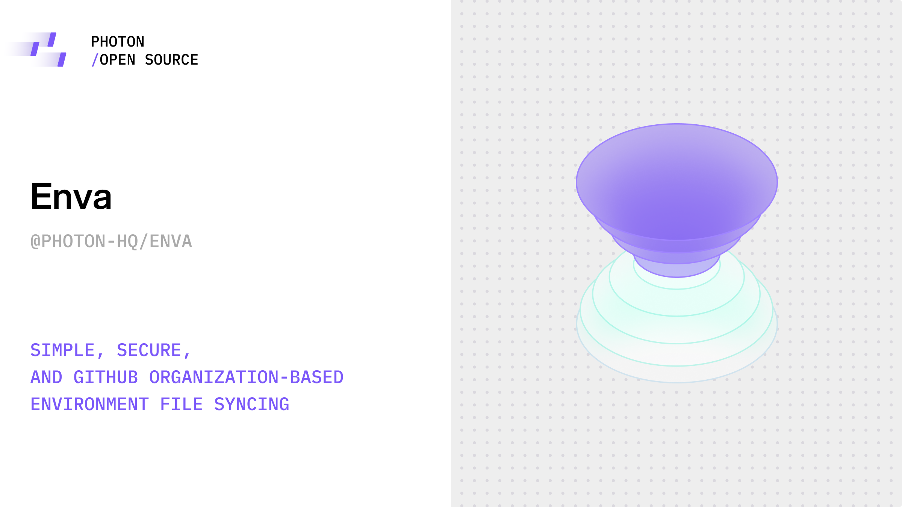

<div align="center">



# Enva

> Sync environment files across team members working in the same GitHub repo

</div>

[](https://www.rust-lang.org/)
[](./LICENSE)
[](https://discord.gg/bZd4CMd2H5)

Enva is a CLI tool that keeps environment files synchronized across every contributor working on your GitHub repositories. It installs Git hooks that push `.env*` files on every commit and hydrate fresh values whenever teammates pull or checkout. The optional encryption layer keeps secrets locked with AES-256-GCM keys stored in the system keychain.

- [Highlights](#highlights)
- [Installation](#installation)
- [Quick Start](#quick-start)
- [CLI Commands](#cli-commands)
- [Security & Encryption](#security--encryption)
- [How It Works](#how-it-works)
- [Self-Host](#self-host)
- [Limitations](#limitations)

## Highlights

- **GitHub-native security** – validates access through GitHub tokens; write permission on any repo passes, otherwise organization repos allow read permission if you’re an org member.
- **Continuous sync** – Git hooks push after every commit and pull the right `.env*` files after merges or checkouts.
- **Branch aware** – each commit carries its own environment; switching branches swaps `.env` files instantly.
- **Optional encryption** – turn on AES-256-GCM at rest with `enva active --password`, deriving keys via PBKDF2 and storing them in the OS keychain.
- **Self-host or run managed** – ship the server with Nixpacks/Railway/Render in minutes.

## Installation

### Prerequisites

- Rust (for cargo install)
- GitHub personal access token or the [GitHub CLI](https://cli.github.com/) (authenticated)
- Git repository you can access (organization or personal)

### Install from crates.io

```bash
cargo install enva
enva --version
```

### Build from source

```bash
git clone https://github.com/photon-hq/enva.git
cd enva
cargo install --path crates/client
enva --version
```

## Quick Start

### 1. Authenticate

```bash
# Personal access token
enva login --token ghp_your_token_here

# Or pull the token from GitHub CLI (requires `gh auth login`)
enva login --gh
```

### 2. Activate inside a repo

```bash
cd your-repo
enva active
```

Activation verifies GitHub access, installs `post-commit`, `post-merge`, and `post-checkout` hooks pointing to the `enva` binary, and pulls the latest environment snapshot for the current commit.

### 3. (Optional) Turn on encryption

```bash
cd your-repo
enva active --password "shared-secret"
```

The CLI derives a repo-scoped key with PBKDF2 (100k iterations, SHA-256), stores the derived key in the native keychain, and marks the repo as encrypted in `~/.config/enva/config.toml`. Share the same password with your teammates so every machine encrypts/decrypts consistently.

### 4. Work as usual

```bash
echo "API_KEY=secret" >> .env.local
git commit -am "Update API config"
# post-commit hook uploads secrets securely

git pull
# post-merge/checkout hook fetches the correct .env files
```

## CLI Commands

| Command | Description                                                                                                            |
| --- |------------------------------------------------------------------------------------------------------------------------|
| `enva login --token <token>`<br>`enva login --gh` | Store a GitHub token used for every commit/fetch call. `--gh` shells out to `gh auth token`.                           |
| `enva active [--password <secret>]` | Validates repo ownership, writes Git hooks, optionally enables encryption (see above), and performs an initial fetch.  |
| `enva fetch` | Manually pull environment files for the current commit (the Git hooks call this automatically after merges/checkouts). |
| `enva commit` | Manually push environment files for the current commit (the Git hooks call this automatically after commits).          |

## Security & Encryption

- **Token gated** – every API call includes your GitHub PAT/CLI token and is verified against the repo via the GitHub API.
- **Permission enforcement** – Write access on any repository is sufficient; if you only have read access, Enva allows it when the repo is organization-owned and you’re a confirmed member of that org.
- **AES-256-GCM encryption** – opt-in per repo with `--password`. Nonces are random per file, ciphertext is base64 encoded, and only your machine holds the derived key (in the OS keychain via `keyring`).
- **Key hygiene** – derived keys are zeroized after storage and never leave the local machine.
- **Transport security** – traffic to the Enva server is handled over HTTPS when deployed behind a TLS terminator (e.g., Railway, Render, Vercel Edge).

## How It Works

1. **Activation** – installs Git hooks that wrap the `enva commit` and `enva fetch` subcommands.
2. **Commit** – after each `git commit`, Enva bundles every file matching `.env*`, encrypts when enabled, and uploads them along with the commit SHA.
3. **Fetch** – after `git pull` or `git checkout`, Enva downloads the environment snapshot for the checked-out commit and decrypts if needed.
4. **Branch-aware** – since data is keyed by commit SHA, every branch automatically receives the correct `.env` values when you switch.

## Self-Host

Enva ships with a ready-to-deploy server for developers who wanna self-host. The fastest path to a persistent deployment is the included Docker Compose stack, which also works great as the base for production setups.

### Configure environment

Create a `.env` file in the repo root before deploying so the server and CLI agree on their connection details:

```bash
PORT=8080
ENVA_CONFIG_PATH=/config
```

- `PORT` tells the Enva server which port to bind to.
- The server stores `db.toml` directly under the directory referenced by the `ENVA_CONFIG_PATH` environment variable and every uploaded `.env*` snapshot under an `envs/` subdirectory within that directory. Point it at a persistent path so restarting a container or VM does not wipe the data.
- If you omit `ENVA_CONFIG_PATH` the shared crate falls back to the OS config directory.

### Docker Compose (recommended)

The `docker-compose.yml` file builds the server using the Nixpacks Dockerfile, mounts the `enva_data` volume at `/config`, and sets `ENVA_CONFIG_PATH=/config` so uploads persist automatically. Spin it up with:

```bash
docker compose up --build -d enva-server
```

Expose the HTTP port by adding a `ports` block (or override via `docker compose --project-name ...` if you prefer a different service name):

```yaml
services:
  flux-server:
    ports:
      - "8080:8080"
```

The named volume keeps `/config/db.toml` plus `/config/envs/` alive between restarts. Remove it with `docker volume rm enva_data` only when you intend to wipe every stored environment snapshot.

### Deploy with Nixpacks (alternative)

```bash
git clone https://github.com/photon-hq/enva.git
cd enva
nixpacks build . --name enva-server
docker run -d \
  --name enva-server \
  -p 8080:8080 \
  -e ENVA_CONFIG_PATH=/config \
  -v enva_data:/config \
  enva-server
```

Use any host path or named volume instead of `enva_data` if you already manage a standard data directory.

## Limitations

- GitHub repositories only (the CLI rejects other Git hosts).
- Only files matching the `.env*` pattern are synced.
- Requires an active internet connection to talk to the GitHub API and the Enva server.
- Encryption must be enabled on every collaborator's machine (with the same password) before commits are stored encrypted.

## Contributing

Issues and pull requests are welcome. Please open a discussion if you plan to make significant changes so we can align on direction.

## License

Licensed under the [MIT License](LICENSE).
